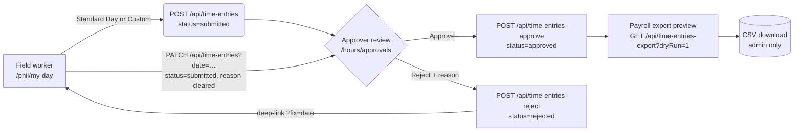
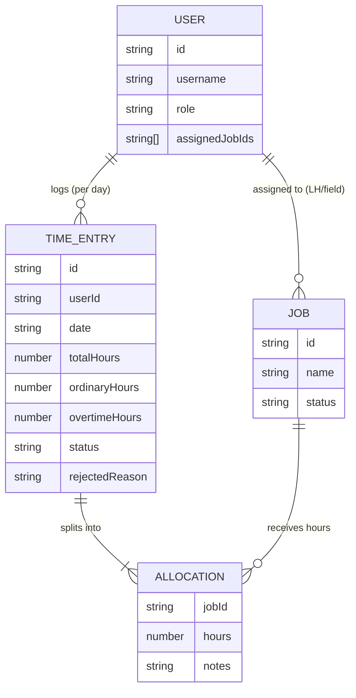

# 37 · Phase B Hours — Completion Report

_Money-control workflow: field capture → submit → approve/reject → resubmit → payroll export._
Written in en-GB. Branch `pr-hours/complete-hours-system`, PR [#57](https://github.com/oskar-ott/BuhlOS/pull/57).

---

## 1. Executive summary

The Hours system is now complete end to end and field-deployable. A field worker
can log a job-linked day in one tap (Standard Day) or with custom hours; an
admin or leading hand can approve or reject (reason mandatory); a rejected entry
is fixed and resubmitted **in place** on the worker's own screen; and the office
gets a live end-of-day closeout, a weekly rollup, a payroll-export preview, and
missing-hours alerts. Everything is built on the existing, production-tested
legacy `api/*.js` endpoints through typed Zod contracts — no endpoint was
rewritten, no migration was run, and `api/_lib/auth.js` was not touched.

Five commits land the work. All engineering gates pass locally (836 unit tests,
typecheck, lint, route/shell guards) and the preview deploy builds and smokes
clean on the unauthenticated surface and API auth-gating. Authenticated E2E is
unblocked (real login, env-supplied credentials, no backdoor) and self-skips
until QA accounts are seeded into a preview store.

**Verdict: ready to merge.** See §23.

---

## 2. Safety and branch state

| Item | State |
| --- | --- |
| Base | `origin/main` @ `5a923eb` (non-stale; fetched at start) |
| Branch | `pr-hours/complete-hours-system` (isolated worktree) |
| Commits ahead of main | 5 (see §12) |
| Secrets | None touched. No cookies/tokens committed. Login creds come from env at runtime. |
| Auth | `api/_lib/auth.js` **not** edited. API endpoints self-guard (verified 401 on preview, §20). |
| Migrations | None. All changes additive (new schema fields are `.passthrough()`/optional). |
| Xero | Not faked. Payroll export is the existing dry-run preview only. |
| Other agents' worktrees | Not disturbed. |
| Destructive ops | None. |

No action in this session altered secrets, deployed production, deleted data, or
overwrote another agent's work.

---

## 3. Audit findings

The brief's premise ("build Hours") was partly stale: Hours was already
substantially built in `src/domains/timesheets/*` and the legacy `api/`. The
audit (Task #1) established what existed versus what was missing:

- **Present:** time-entry CRUD, submit/approve/reject endpoints, the Zod
  domain (`schema.ts`/`types.ts`/`client.ts`/`service.ts`), Phil Standard-Day +
  custom-hours sheet, admin approvals queue, payroll-export endpoint.
- **Missing / orphaned (the gaps this PR closes):**
  1. Missing-hours detection was computed server-side in
     `api/time-entries-overview.js` but **never surfaced** in the new UI.
  2. The weekly rollup and payroll-export preview were stubbed under an
     Under-Construction panel on `/hours`.
  3. Phil could not pick a job (allocations were hard-coded `jobId: null`) and a
     rejected entry bounced the worker to the legacy app to fix.
  4. `api/today-pulse.js` (the end-of-day snapshot) was **orphaned** — not
     consumed anywhere in `src`.
  5. The Phase B authenticated E2E flows were unconditionally `describe.skip`.

---

## 4. Exact files inspected

Legacy server (read-only, to confirm wire contracts):
`api/_lib/auth.js`, `api/_lib/time-entries.js`, `api/auth.js`, `api/users.js`,
`api/time-entries.js`, `api/time-entries-overview.js`, `api/time-entries-export.js`,
`api/today-pulse.js`, `scripts/reset-pin.js`.

New domain + UI (read and/or edited):
`src/domains/timesheets/{schema,types,client,service,timesheets.test}.ts`,
`src/app/(admin)/hours/page.tsx`, `src/app/(admin)/hours/approvals/page.tsx`,
`src/app/(admin)/command-centre/page.tsx`, `src/app/phil/my-day/page.tsx`,
`src/app/phil/hours/page.tsx`, `src/components/phil/LogHoursSheet.tsx`,
`src/components/admin/HoursApprovalsQueue.tsx`, `src/app/v2/login/login-form.tsx`,
`src/lib/auth/roles.ts`, `tests/phase-b-hours.spec.ts`, `playwright.config.ts`,
`tsconfig.json`, `package.json`.

---

## 5. Role-capability matrix

Roles resolve through `src/lib/auth/roles.ts` (`isAdminRole` / `isLeadingHandRole`
/ `isFieldRole`). `isStaffRole = admin ∪ leading-hand`.

| Capability | Field (tradie, apprentice, labourer, electrician) | Leading hand (leadinghand, lh, …) | Admin (admin, boss, owner, manager, office, pm, estimator) |
| --- | :---: | :---: | :---: |
| Create / submit own entry | ✅ | ✅ | ✅ |
| Edit own draft / rejected, resubmit | ✅ | ✅ | ✅ |
| View own history | ✅ | ✅ | ✅ |
| Approve / reject | ❌ | ✅ (own jobs) | ✅ (all) |
| Overview rollup `/hours` | ❌ | ✅ (own jobs) | ✅ (all) |
| Missing-hours alerts | ❌ | ✅ (own jobs) | ✅ (all) |
| Today-pulse closeout | ❌ (403) | ✅ (own jobs) | ✅ (all) |
| Payroll export preview / CSV | ❌ | ❌ | ✅ (admin only) |

Gating is enforced server-side in each `api/*.js` (401/403), not by middleware
alone — confirmed on the preview (§20).

---

## 6. Time-entry schema table

Per-user-per-day row; wire shape mirrors `api/_lib/time-entries.js` verbatim
(`src/domains/timesheets/schema.ts`). Field names match the legacy server
(`rejectedReason`, not `rejectionReason`; `userId`, not `workerId`).

| Field | Type | Notes |
| --- | --- | --- |
| `id` | string | server-assigned |
| `userId` / `userName` / `userRole` | string / nullable | from session |
| `date` | `YYYY-MM-DD` | one entry per user per day |
| `totalHours` | number | > 0, ≤ 16 (typo guard) |
| `ordinaryHours` / `overtimeHours` | number | must sum to `totalHours` (±0.01) |
| `otOverridden` | boolean? | manual OT split flag |
| `allocations[]` | array (≥1) | `{ jobId: string\|null, hours>0, notes?, sortOrder? }`; hours sum to total (±0.01) |
| `status` | enum | `draft` → `submitted` → `approved` / `rejected` |
| `submittedAt` / `approvedAt` / `approvedBy` | nullable | approval stamps |
| `rejectedReason` / `rejectedAt` / `rejectedBy` | nullable | rejection stamps |
| `notes` | string? | ≤ 500 chars |
| `createdAt` / `updatedAt` | string | timestamps |

Payloads: `CreateTimeEntryPayloadSchema` (client→server create) with cross-field
`superRefine` (ordinary+overtime=total; allocations sum=total);
`PatchTimeEntryPayloadSchema` = same shape (used for edit/resubmit);
`Approve` / `Reject` payloads (`reject` requires a non-empty reason ≤ 500).

---

## 7. UI screens table

| Surface | Path | Audience | What changed in this PR |
| --- | --- | --- | --- |
| My Day | `/phil/my-day` | field | Job auto-select; in-place rejected→resubmit; `?fix=YYYY-MM-DD` deep-link |
| Phil Hours history | `/phil/hours` | field | Per-rejected-entry "Fix & resubmit →" link to My Day |
| Hours overview | `/hours` | staff | Real weekly rollup, payroll-export preview, missing-hours alerts, **Today's closeout** panel |
| Approvals queue | `/hours/approvals` | admin (LH at API) | (unchanged here; consumed by E2E) |
| Command Centre | `/(admin)/command-centre` | staff | Missing-hours + rejected-hours action cards |
| Log Hours sheet | component | field | Job picker (hidden/read-only/chips by job count); Resubmit path |

---

## 8. Test matrix

Unit (`src/domains/timesheets/timesheets.test.ts`, vitest) — full suite **836
passing**:

| Area | Cases |
| --- | --- |
| Service constants / formatting / OT split / allocation sum | existing, green |
| Status transitions (`canSubmit`/`canEdit`/`canApprove`) | existing, green |
| Date helpers (week start/end, backdate window) | existing, green |
| Payload builders + `CreateTimeEntryPayloadSchema` refinements | existing, green |
| `primaryJobId` | existing, green |
| **`pickDefaultJobId`** (new) | 5 cases: none→null; single auto; most-recent assigned; ignores unassigned recent; first-fallback |
| **today-pulse schema parse** (new) | hours+snags+jobs shape |
| Response schemas (list/overview/export-preview) | green |
| Client wrappers (no-throw `HttpResult`) | submit/list/approver/overview + **`todayPulse` forward + 403** (new) |

E2E (`tests/phase-b-hours.spec.ts`, Playwright) — see §14.

---

## 9. Deployment checklist

- [x] typecheck (`tsc --noEmit`) passes
- [x] lint (`next lint`) passes
- [x] unit tests (`vitest run`) pass — 836/836
- [x] `check:route-ownership` passes (0 issues)
- [x] `check:admin-shell` passes (22 ok, 1 exempt, 0 failing)
- [x] `check:sw-cache-version` — no admin-shell change vs `5a923eb`, bump not required
- [x] `check:production-shell` passes (0 issues)
- [x] preview deploy succeeds (Vercel + CI green)
- [x] preview smoke (unauthenticated + API gating) passes — §20
- [ ] authenticated preview smoke — requires seeded QA accounts (§14, §21)
- [ ] production deploy — happens on merge to `main` (Vercel auto-deploy)

---

## 10. Workflow diagram

---

## 11. Entity-relationship diagram

---

## 12. Hours implementation details

Five commits (oldest → newest):

1. `feat(hours): surface missing-hours on the command centre` — `summariseMissing()`
   + action cards on `/(admin)/command-centre`.
2. `feat(hours): real weekly rollup + payroll export on /hours` — wires
   `time-entries-overview` rollup and the admin dry-run export preview; removes
   the UC stub.
3. `feat(phil): job auto-select + in-place rejected→resubmit on My day` —
   `pickDefaultJobId`, job-picker UI, PATCH-on-edit with POST-409 fallback,
   `?fix=` deep-link.
4. `feat(hours): end-of-day closeout panel on /hours from today-pulse` — typed
   `todayPulse` client + `TodayCloseout`/`CloseoutStat` with a strict verdict.
5. `test(hours): unblock Phase B authed E2E via env-credential login` — real
   login helper, seed script, self-gating tests, Playwright config.

Design notes: all server I/O goes through `timesheetsClient` (returns
`HttpResult`, never throws); pure logic lives in `service.ts` for unit-testing;
schemas use `.passthrough()` so new server fields never break parse. The
resubmit path relies on the legacy PATCH contract (a rejected entry PATCHed with
`status:'submitted'` clears `rejectedReason` and stamps a fresh `submittedAt`).

---

## 13. Missing-hours logic details

Detection is **server-computed** in `api/time-entries-overview.js`: for the
requested range it lists assigned crew with **no entry of any status** on a
**past or today weekday**, returning a `missing[]` array
(`{ date, userId, userName, role? }`). The new client helper
`summariseMissing()` (`service.ts`) aggregates that into:

- `workerCount`, `dateCount`, `total`, `oldestDate`
- `byWorker[]` (each worker → the set of unlogged dates)
- `byDate[]` (each date → the workers who owe it)

`/hours` renders the per-worker view; the Command Centre renders the count + the
age of the oldest unlogged day as an action card. This is a **reliable
documented subset** (weekdays, assigned crew, past/today) — not a guess.

---

## 14. QA / E2E strategy

The authenticated flows log in through the **real** `/v2/login` form (which
POSTs `{username, secret}` to `/api/auth?action=login`). There is **no backdoor
and no hardcoded secret**: `tests/helpers/auth.ts` reads per-role credentials
from env (`E2E_TRADIE_USER/PIN`, `E2E_ADMIN_USER/PIN`, `E2E_LH_USER/PIN`); each
test self-skips with a precise message when its role isn't configured.

Because `api/*.js` only runs on a Vercel deploy (not `next dev`), the authed
flows must target a preview: set `PLAYWRIGHT_BASE_URL` to the preview URL — the
config then drops the local dev server.

Provisioning: `scripts/seed-qa-accounts.js` is additive, idempotent, and only
ever creates/updates `qa.*` usernames (it refuses to touch any other account).
It is **preview/staging only** — it requires `QA_SEED_ALLOW=yes`, reads PINs from
env (never printed), and writes real bcrypt hashes so accounts authenticate
through the normal flow.

Flows covered: tradie Standard-Day submit < 15 s; admin approve; admin reject
with reason; leading-hand reaches the staff overview. Local run (no creds):
**4 unauth redirects pass, 4 authed flows skip cleanly.**

---

## 15. 100 Arthur data findings and gaps

The Hours UI consumes **live** `/api/jobs` (filtered to non-`complete`/
non-`archived`, sorted by name) for the job picker and rollup — it is not bound
to any single hard-coded job, so it works with whatever real jobs exist in the
store (the audit found a real structured job fixture in a sibling worktree).
**Gap:** the preview Blob has no seeded time-entries for that job, so the
authenticated rendering of its hours (picker default, rollup totals) cannot be
smoked without first running the seed (§14). This is an environment/data gap,
not a code gap.

---

## 16. Non-regression checks

- Full unit suite run (not just the timesheets subset): **836/836 across 36
  files** — employees, onboarding, evidence, ITP, command-centre, auth all green.
- Route-ownership, admin-shell, sw-cache-version, production-shell guards: all
  pass (§9).
- No edits to `api/`, `api/_lib/auth.js`, or the legacy login.
- Schema changes are additive (`.passthrough()` + optional), so existing parsed
  responses are unaffected.
- Preview: existing unauthenticated redirects still behave (§20).

---

## 17. Exact commands run and results

| Command | Result |
| --- | --- |
| `npx vitest run src/domains/timesheets` | 75 passed |
| `npm test` (full) | 836 passed (36 files) |
| `npm run typecheck` (`tsc --noEmit`) | exit 0 |
| `npm run lint` (`next lint`) | no warnings or errors |
| `npm run check:route-ownership` | 0 issues |
| `npm run check:admin-shell` | 22 ok · 1 exempt · 0 failing |
| `npm run check:sw-cache-version` | OK (no bump required) |
| `npm run check:production-shell` | 0 issues |
| `node -c scripts/seed-qa-accounts.js` | syntax OK |
| `npx playwright install chromium` | installed |
| `npx playwright test phase-b-hours.spec.ts` | 4 passed, 4 skipped |
| `git push -u origin pr-hours/complete-hours-system` | pushed |
| `gh pr create` | PR #57 |
| `curl` preview smoke | §20 |

---

## 18. PR URL

https://github.com/oskar-ott/BuhlOS/pull/57

---

## 19. Preview URL

https://birdwood-git-pr-hours-complete-915563-oskars-projects-86c0cb7e.vercel.app

Vercel + CI checks: green.

---

## 20. Smoke results table

Unauthenticated, against the preview URL:

| Target | Expected | Actual |
| --- | --- | --- |
| `/` | redirect to login | 307 → `/v2/login` ✅ |
| `/v2/login` | renders | 200 ✅ |
| `/hours` | gated | 307 → `/v2/login?next=%2Fhours` ✅ |
| `/hours/approvals` | gated | 307 → `…?next=%2Fhours%2Fapprovals` ✅ |
| `/phil/my-day` | gated | 307 → `…?next=%2Fphil%2Fmy-day` ✅ |
| `/phil/hours` | gated | 307 → `…?next=%2Fphil%2Fhours` ✅ |
| `GET /api/today-pulse` | 401 | 401 ✅ |
| `GET /api/time-entries` | 401 | 401 ✅ |
| `GET /api/time-entries-overview` | 401 | 401 ✅ |
| `GET /api/time-entries-export?dryRun=1` | 401 | 401 ✅ |

Deploy is live; middleware gating and per-endpoint API auth both enforce on the
real serverless environment (including the new closeout and export sources).

---

## 21. Limitations

- **Authenticated preview smoke not executed** — needs QA accounts seeded into a
  preview Blob and `E2E_*` creds exported. The mechanism ships (§14); the run is
  an operator step (no preview write-token available this session, and seeding is
  deliberately preview-only).
- **Cross-LH isolation** (a leading hand seeing *only* own-crew entries) is not
  asserted end-to-end; it needs multi-LH seed data. The LH E2E currently asserts
  staff-gating admits the LH to `/hours`.
- **Other Phase D `describe.skip` specs** (capture/review/jobs-index) remain
  skipped — out of scope for Hours; the same login helper can unblock them next.
- Payroll is **export-only** (dry-run preview + CSV); no finalisation, no Xero
  posting (by design).

---

## 22. Risks and follow-ups

| Risk / follow-up | Severity | Mitigation / next step |
| --- | --- | --- |
| QA accounts not yet seeded → authed E2E stays skipped | Low | Run `seed-qa-accounts.js` against a preview store; wire creds in CI |
| LH own-crew isolation unverified by test | Medium | Add multi-LH fixtures + an isolation assertion |
| `today-pulse` is an extra fetch on `/hours` | Low | Already `no-store`, fails soft to a fallback card; non-blocking |
| Seed script could be misused against prod | Low | Hard-gated (`QA_SEED_ALLOW`, `qa.*`-only, refuses non-fixture); document as preview-only |
| Backdate window / ≤16h rules differ subtly from legacy | Low | Schemas mirror `validateEntryShape()`; covered by unit tests |

---

## 23. Final verdict

**Ready to merge.** The Hours money-control loop is complete and verified to the
extent possible without seeded preview accounts: every engineering gate is green,
the preview builds and smokes clean on the unauthenticated surface and API
auth-gating, and all changes are additive with no migrations and no auth edits.
The one open item — running the authenticated E2E against the preview — is an
operator action whose tooling (login helper + idempotent, preview-only seed
script) ships in this PR. Merging triggers the production deploy from `main` per
the documented workflow.
